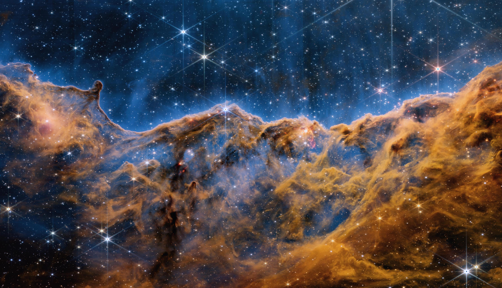
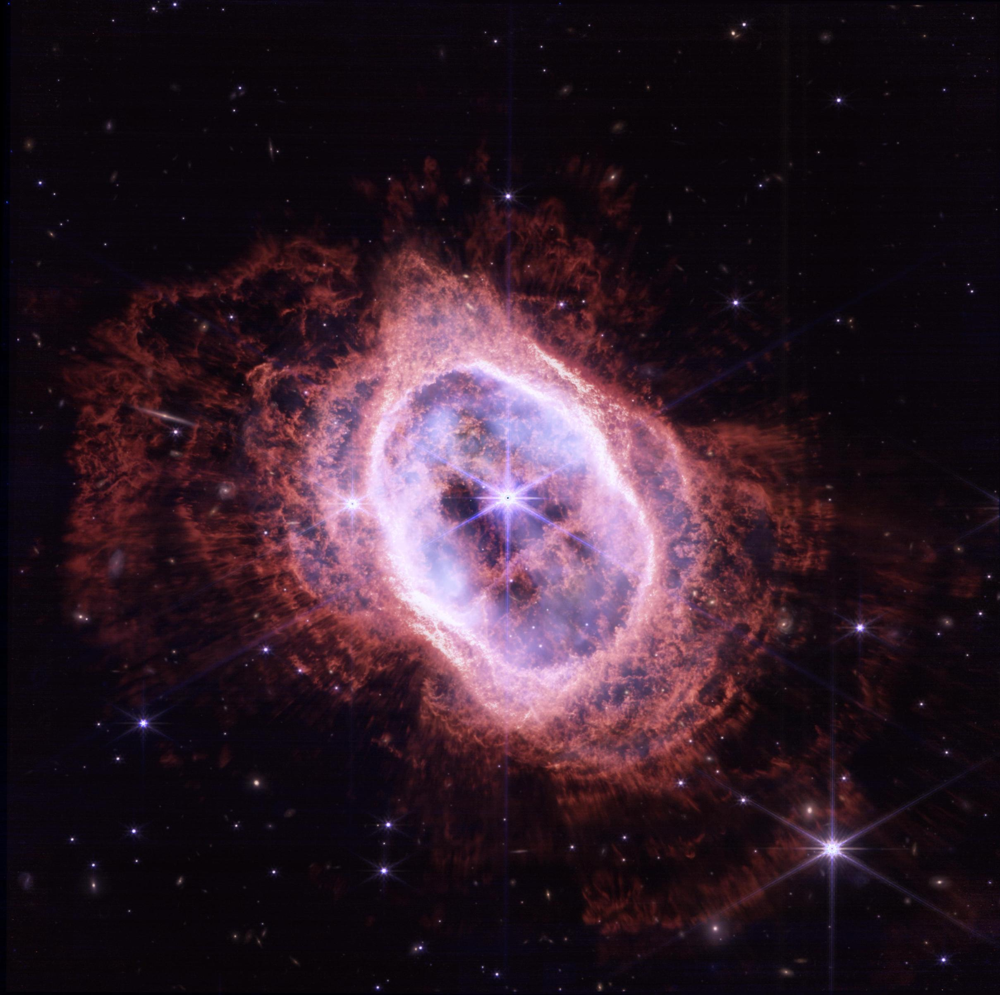
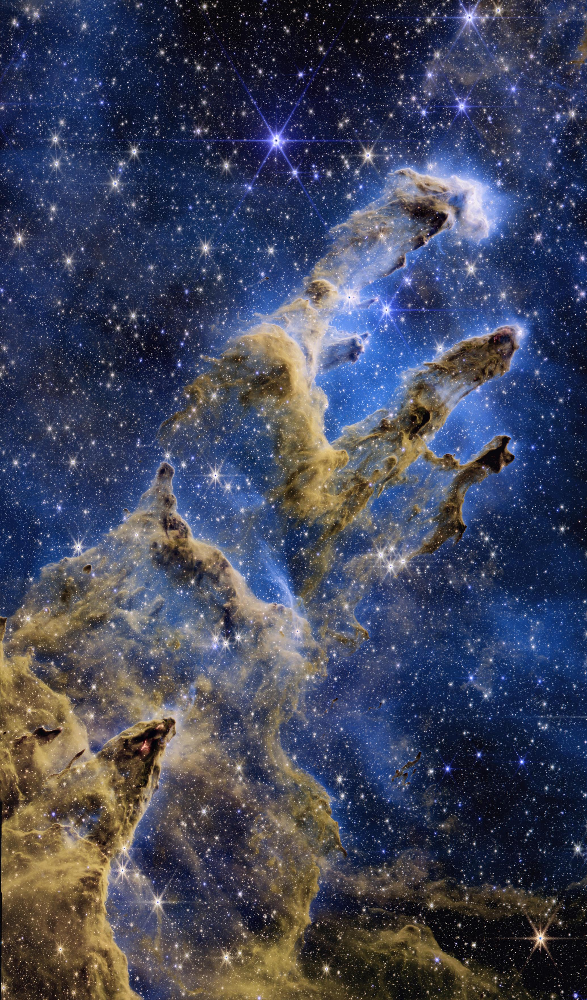
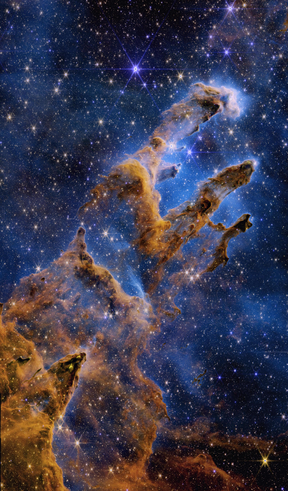
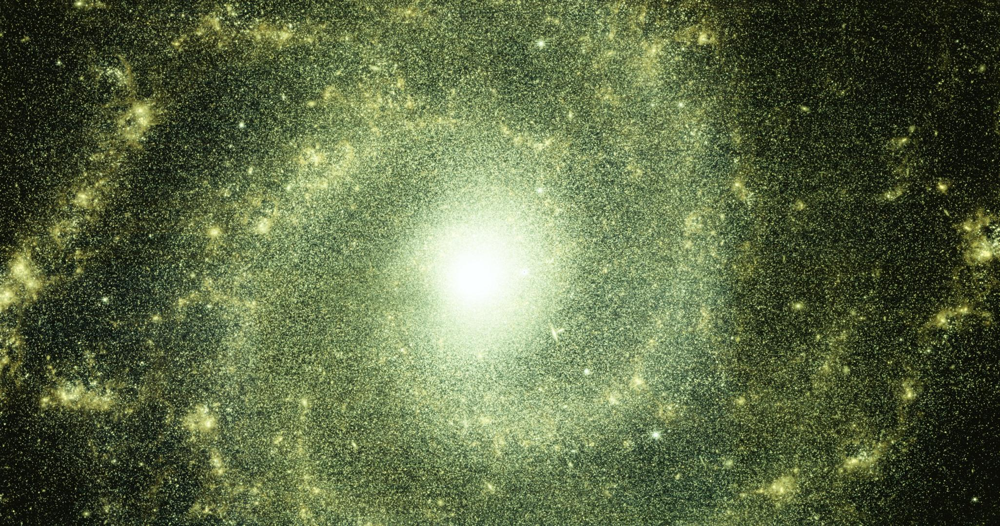

# Webbster

A simple, easy-to-use utility to transform raw JWST (James Webb Space Telescope) data into viewable, color images.

[](example_images/original/tarantula_nebula_custom_crop.jpg?raw=true)

## Index

- [Introduction](#introduction)
- [Getting started](#getting-started)
- [`fits-to-image.py`](#fits-to-imagepy)
  - [Usage](#usage)
  - [Arguments](#arguments)
  - [Notes](#notes)
- [`combine-layers.py`](#combine-layerspy)
  - [Usage](#usage-1)
  - [Arguments](#arguments-1)
  - [Notes](#notes-1)
  - [Colors file formatting](#colors-file-formatting)
- [Tutorial](#tutorial)
  - [1. Download data from the MAST Portal](#1-download-data-from-the-mast-portal)
  - [2. Turn the raw images into viewable, aligned images with `fits-to-image.py`](#2-turn-the-raw-images-into-viewable-aligned-images-with-fits-to-imagepy)
  - [3. Tweak the result using `combine-layers.py`](#3-tweak-the-result-using-combine-layerspy)
- [Downloading data from the MAST portal](#downloading-data-from-the-mast-portal)
  - [Choose an object](#choose-an-object)
  - [Download ZIP file](#download-zip-file)
  - [Extract `.fits` files](#extract-fits-files)
- [Example images](#example-images)
- [How it works](#how-it-works)
  - [Background](#background)
  - [Normalization](#normalization)
  - [Alignment](#alignment)
  - [Colorization](#colorization)
  - [Blending](#blending)
- [Future plans](#future-plans)

## Introduction

Every image you've seen is fake. Of course, when you take a picture, it represents a real object, but it does not look exactly as it would if you were there, looking at it yourself.

This is because cameras capture raw data, and it is the way that they synthesize this data into an image that determines how it will look. In the case of space telescopes, they capture images of objects that would be impossible to see with human eyes, whether it be light that is too dim or of an invisible wavelength.

So, our goal when processing these images is not necessarily realism, but more artistic considerations such as clarity, contrast, and beauty. Hopefully, this program can give you a starting point to realize your own artistic vision of space.

## Getting started

1. Clone this repo:

   ```
   git clone https://github.com/evoth/webbster.git
   ```

2. Install the required libraries:

   **WARNING:** Only tested for Python version 3.9

   ```
   pip3 install -r requirements.txt
   ```

3. Run [`fits-to-image.py`](#fits-to-imagepy) and/or [`combine-layers.py`](#combine-layerspy) as described in the [tutorial](#tutorial) below, modify my scripts, or write your own using the functions in the `webbster` module!

## `fits-to-image.py`

Converts a folder of FITS images to a single image. Optionally exports a grayscale image for each layer.

### Usage:

```
python fits-to-image.py [-h] [-j] INPUT_FOLDER OUTPUT_IMAGE [LAYERS_FOLDER]
```

### Arguments:

| Argument               | Description                                                  | Example             | Required? |
| ---------------------- | ------------------------------------------------------------ | ------------------- | --------- |
| `INPUT_FOLDER`         | A folder containing the JWST `.fits` files to compile        | `fits`              | Yes       |
| `OUTPUT_IMAGE`         | The filepath of the output image                             | `cosmic_cliffs.jpg` | Yes       |
| `LAYERS_FOLDER`        | Folder into which to export a grayscale image for each layer | `layers`            | No        |
| `-j` or `--jpg_layers` | When exporting layers, use .jpg extension instead of .png    |                     | No        |
| `-h` or `--help`       | Show help message                                            |                     | No        |

### Notes

- `INPUT_FOLDER` must be a folder of files ending in `_i2d.fits` taken at the same time by JWST (see [guide on downloading data](#downloading-data-from-the-mast-portal) below).
- Recommended file extensions for `OUTPUT_IMAGE` are either `.png` or `.jpg`. Using `.png` with give you near-lossless 8-bit images, but the files may be large. Using `.jpg` saves on space with little loss of quality.
- `LAYERS_FOLDER` is not required, but it is necessary if you end up wanting to tweak the colors using [`combine-layers.py`](#combine-layerspy).
  - The default extension for the layers is `.png`, but if you need to save on space, use the `-j` flag to save layers in `.jpg`.

## `combine-layers.py`

Converts a folder of grayscale layer images to a single image, with the option to customize the color of each layer.

### Usage:

```
python combine-layers.py [-h] [--export_colors_file EXPORT_COLORS_FILE] INPUT_FOLDER OUTPUT_IMAGE [COLORS_FILE]
```

### Arguments:

| Argument                                  | Description                                                                       | Example             | Required? |
| ----------------------------------------- | --------------------------------------------------------------------------------- | ------------------- | --------- |
| `INPUT_FOLDER`                            | A folder containing the grayscale layer images to compile                         | `layers`            | Yes       |
| `OUTPUT_IMAGE`                            | The filepath of the output image                                                  | `cosmic_cliffs.jpg` | Yes       |
| `COLORS_FILE`                             | Path to file with custom colors for each layer                                    | `custom_colors.txt` | No        |
| `--export_colors_file EXPORT_COLORS_FILE` | Path to export the colors used for each layer (in the same format as COLORS_FILE) | `colors.txt`        | No        |
| `-h` or `--help`                          | Show help message                                                                 |                     | No        |

### Notes

- The images in `INPUT_FOLDER` should be grayscale images generated by [`fits-to-image.py`](#fits-to-imagepy). Renaming them may cause issues because the script uses the filename to get the name of its filter when automatically choosing the color.
- Same as above, using `.png` as opposed to `.jpg` for `OUTPUT_IMAGE` may get you marginally better quality, at the cost of a bigger file. However, `.png` will be of no benefit if the images in `INPUT_FOLDER` are already saved as `.jpg`.
- For a guide on the formatting for `COLORS_FILE`, see below.

### Colors file formatting

The following is the format for each line of a colors file:

```
"FILEPATH" (HUE, SATURATION, VALUE)
```

- `FILEPATH` is the the path to an image in the specified folder
- `HUE`, `SATURATION`, and `VALUE` can each either be:
  - A single number (e.g. `75`)
  - A range (e.g. `75-100`), which will generate a random value on that range (inclusive)
- The ranges for `HUE`, `SATURATION`, and `VALUE` are [0-360], [0-100], and [0-100], respectively.

The following is an example colors file:

```
"layers/JW02731_NIRCAM-F090W.png" (200-240, 87, 100)
"layers/JW02731_NIRCAM-F187N.png" (208, 50-100, 100)
"layers/JW02731_NIRCAM-F200W.png" (200, 67, 100)
"layers/JW02731_NIRCAM-F335M.png" (0-359, 0-100, 0-100)
"layers/JW02731_NIRCAM-F444W.png" (4, 24, 100)
"layers/JW02731_NIRCAM-F470N.png" (0, 98, 100)
```

Any image present in the folder that is not referenced in the colors file will be colored as default from the filter name in the filename.

## Tutorial

### 1. Download data from the MAST Portal

- Follow the steps outlined in the [guide below](#downloading-data-from-the-mast-portal). After this is done, you should have a folder with only FITS files that end in `_i2d.fits`. Also check that `nircam` or `miri` is somewhere in each filename, since as of now this project is tailored toward NIRCAM and MIRI images from JWST.

### 2. Turn the raw images into viewable, aligned images with `fits-to-image.py`

- Take a look at [`fits-to-image.py`](#fits-to-imagepy) above. This script will turn each of our `.fits` files into a layer image, then attempt to combine these grayscale images into a single color image.
- To do this, we tell the script where our `.fits` files are located, where we want the final image to be saved, and where we want it to save the intermediate layer images (the latter is optional, but necessary if we want to tweak the result like in step 3).
- For example, if your `.fits` files are in a folder called `fits`, and you want it to save the layers to a folder called `layers`, and you want the output image to be called `cosmic_cliffs.jpg`, then you would call `fits-to-image.py` as shown below:

  ```
  python fits-to-image.py fits cosmic_cliffs.jpg layers
  ```

- If everything worked correctly, the layers folder should now have a grayscale image named something like `JW02731_NIRCAM-F090W.png` for each `.fits` file you had, and the final image should also be ready to view!

### 3. Tweak the result using `combine-layers.py`

- See [`combine-layers.py`](#combine-layerspy) above. This script combines preprocessed layers images (created using `fits-to-image.py`) into a single color image, with the option to customize the colors of each layer so that you can get any look you want.
- Running `combine-layers.py` without specifying a "colors file" will simply result in the same image created in step 2. But, if we have it export the colors it used, we can then have a starting point from which to start getting creative.
- So, to get this "template" colors file, we can run `combine-layers.py` as shown below (assuming the same folders from step 2):

  ```
  python combine-layers.py layers cosmic_cliffs.jpg --export_colors_file colors.txt
  ```

- The result (`colors.txt` in this example) should look something like this:

  ```
  "layers/JW02731_NIRCAM-F090W.png" (239, 87, 100)
  "layers/JW02731_NIRCAM-F187N.png" (208, 100, 100)
  "layers/JW02731_NIRCAM-F200W.png" (200, 67, 100)
  "layers/JW02731_NIRCAM-F335M.png" (59, 75, 100)
  "layers/JW02731_NIRCAM-F444W.png" (4, 24, 100)
  "layers/JW02731_NIRCAM-F470N.png" (0, 98, 100)
  ```

- The values on the right are the (hue, saturation, value) for each layer, which you can tweak according to the [colors file formatting](#colors-file-formatting). Assuming we've done this and saved the file as `custom_colors.txt`, then you can make a new image using those colors by running `combine-layers.py` again, but this time using the file as an input:

  ```
  python combine-layers.py layers cosmic_cliffs_custom.jpg custom_colors.txt
  ```

- The new image file should reflect the changes you made!
- Also, if we still want to export the colors it uses (for example if you use random values), then just run it with both arguments:

  ```
  python combine-layers.py layers cosmic_cliffs_custom.jpg custom_colors.txt --export_colors_file colors_preset_1.txt
  ```

- This way, if you find something you like, you can save the colors file to use or improve on later.

## Downloading data from the MAST Portal

### Choose an object

If you don't know what object you want to make an image of, maybe try looking at the `Latest` or `First Images` links on the [Webb Space Telescope website](https://webb.nasa.gov/) to see what objects the JWST has already imaged.

### Download ZIP file

1. Go to the [MAST Portal website](https://mast.stsci.edu/portal/Mashup/Clients/Mast/Portal.html).
2. Under the search bar at the top, click `Advanced Search`.
3. In the text box for the `Mission` filter, type "`JWST`" and hit enter.
4. In the text box for the `Instrument` filter (you may have to scroll down a little), type "`NIRCAM`" and/or "`MIRI`" and hit enter.
5. Use the other filters to narrow down the search to your desired object:
   - The best way is to enter the object name into the `Object Name or Position` filter and press enter.
     - If you know an object's name (e.g. `Carina Nebula`) but not formal designation (e.g. `NGC 3324`), you can go its Wikipedia page and try the first designation listed under `Designations` in the sidebar on the right.
     - If you can't find a designation for the object that works, you can try filtering by `RA` (Right Ascension) and/or `Dec` (Declination). These can also be found in the Wikipedia sidebar for the object.
   - Wait for it to load if there is a loading indicator.
   - If you do this step correctly, the number of `Records Found` in the upper left corner should be no more than a dozen (usually 6 or less).
6. Press the `Search` button in the upper left corner.
7. You see should the results in a table (it may take some time to load).
8. Check the `Show Preview` option at the top of the table to show thumbnails for each result.
9. Select each image you want, making sure that they all have the same subject and framing.
10. Add data products to Download Basket by pressing the icon () at the top of the table.
11. Wait for it to retrieve the files.
12. Check the box next to `JWST` to select the files for download.
13. Press the `Download` button in the upper right corner, and press `Download` again in the confirmation popup.
14. The ZIP should start downloading. Depending on what you selected, it can be over 10GB, so make sure you have storage space available.

### Extract `.fits` files

1. Extract the downloaded ZIP.
2. Create a separate folder to hold the `.fits` files.
3. Open the extracted folder, and navigate further into the folder until there are multiple folders.
4. For each folder containing the word `nircam` or `miri`, open it and move the file ending in `_i2d.fits` to the folder created in step 2.
5. Now we have a folder with all the I2D (Image 2D) FITS files that we need to create a color image. Continue the [tutorial](#tutorial) or run [`fits-to-image.py`](#fits-to-imagepy) on this folder.

## Example images

| From `fits-to-image.py` (cropped)                                                                                                                         | Tweaked using `combine-layers.py`                                                                                                                                       | Colors file used                                                                   |
| --------------------------------------------------------------------------------------------------------------------------------------------------------- | ----------------------------------------------------------------------------------------------------------------------------------------------------------------------- | ---------------------------------------------------------------------------------- |
| [](example_images/original/tarantula_nebula.jpg?raw=true)                              | [](example_images/original/tarantula_nebula_custom.jpg?raw=true)                              | [tarantula_nebula.txt](example_images/colors/tarantula_nebula.txt)                 |
| [](example_images/original/cosmic_cliffs.jpg?raw=true)                                       | [](example_images/original/cosmic_cliffs_custom.jpg?raw=true)                                       | [cosmic_cliffs.txt](example_images/colors/cosmic_cliffs.txt)                       |
| [](example_images/original/southern_ring_nebula.jpg?raw=true)                  | [](example_images/original/southern_ring_nebula_custom.jpg?raw=true)                  | [southern_ring_nebula.txt](example_images/colors/southern_ring_nebula.txt)         |
| [](example_images/original/pillars_of_creation.jpg?raw=true)                     | [](example_images/original/pillars_of_creation_custom.jpg?raw=true)                     | [pillars_of_creation.txt](example_images/colors/pillars_of_creation.txt)           |
| [](example_images/original/pillars_of_creation_miri.jpg?raw=true)      | [](example_images/original/pillars_of_creation_miri_custom.jpg?raw=true)      | [pillars_of_creation_miri.txt](example_images/colors/pillars_of_creation_miri.txt) |
| [](example_images/original/pillars_of_creation_comp.jpg?raw=true) | [](example_images/original/pillars_of_creation_comp_custom.jpg?raw=true) | [pillars_of_creation_comp.txt](example_images/colors/pillars_of_creation_comp.txt) |
| [](example_images/original/messier_74.jpg?raw=true)                                                | [](example_images/original/messier_74_custom.jpg?raw=true)                                                | [messier_74.txt](example_images/colors/messier_74.txt)                             |

Note: If you plan on using one of the colors files provided here, make sure you download the correct FITS images and update the filepaths to match your directory structure.

## How it works

### Background

The [James Webb Space Telescope (JWST)](https://en.wikipedia.org/wiki/James_Webb_Space_Telescope) is an infrared space telescope developed mainly by [NASA](https://en.wikipedia.org/wiki/NASA) in partnership with [ESA](https://en.wikipedia.org/wiki/European_Space_Agency) and [CSA](https://en.wikipedia.org/wiki/Canadian_Space_Agency), and is operated by the [Space Telescope Science Institute (STScI)](https://en.wikipedia.org/wiki/Space_Telescope_Science_Institute). Its near- and mid-infrared imagery capabilities, along with its high resolution and sensitivity, mean that it is able to capture objects dimmer, farther away, and older than any previous space telescope.

The imagery captured by the JWST is used in a variety of astronomical research, and, luckily for us, much of it is available online through the [STScI MAST Portal](https://mast.stsci.edu/portal/Mashup/Clients/Mast/Portal.html). The [JWST Science Calibration Pipeline](https://jwst-docs.stsci.edu/jwst-science-calibration-pipeline-overview) produces a wide variety of data products, but most relevant to our use case are the level 3 (calibrated) 2D image products, which contain the combined, resampled, and calibrated result of each group of exposures; in other words, something resembling a complete image.

However, there's a problem: we can't simply download it to our computer and expect to be able to view it like any other image. This is because the images, instead of being in a common format like `.jpg` or `.png`, come packaged in a file format often used for astronomy called [FITS](https://en.wikipedia.org/wiki/FITS), which has a `.fits` extension.

There are two issues with the image data contained in these FITS files. The first is that it has a [bit depth](https://en.wikipedia.org/wiki/Color_depth), or [dynamic range](https://en.wikipedia.org/wiki/Dynamic_range), that far exceeds that of the screens we use to view media. In other words, each image captured by the JWST, from the pitch black void of space to the centers of galaxies, contains such a wide range of brightness information that it simply can't all be accurately displayed at one time. To deal with this, we have to find a way to crush all of that information into a normal image, while preserving and emphasizing the most interesting details present in the original.

The second issue is that instead of capturing a single color image, the JWST often captures multiple, slightly unaligned grayscale images that each represent a certain band of wavelengths. Meaning that to get the single color image that we want, we end up having to assign each "layer" a somewhat arbitrary color before aligning and overlaying them on top of each other to produce a [false-color](https://en.wikipedia.org/wiki/False_color) image. This creates the illusion of a color image from what was originally taken using infrared light. Although this is not technically "true" color, it can still portray the contrast and differences in intensity between the different wavelength bands, while also looking cool.

So, to recap, the JWST is a telescope in space that takes "images" of various objects in infrared light. And although this data can be found online, there are multiple challenges that must be overcome in order to turn these FITS images into a single color image. Here's how this program attempts to do just that:

### Normalization

As mentioned above, the raw data found in the FITS files that we download has a dynamic range that is much larger than a typical viewable image. Specifically, each pixel can hold 16 bits of information (65536 possible values), whereas your average JPG or PNG only has 8 bits (256 possible values) per color channel for each pixel. In order to convert these 16 bits of brightness data to only 8 bits, it's not enough to just scale down the raw values to fit into the new range; this would result in a mostly dark image with a few specks of light. Instead, we have to artificially enhance, or "stretch", the portion of the original range that contains the majority of the detail.

The first step is "contrast stretching", also known as [normalization](<https://en.wikipedia.org/wiki/Normalization_(image_processing)>). Essentially, we clip off the portions of the brightness range that we don't need (background noise, centers of stars, etc.) and "stretch" the portion of the range that holds the details that we care about (nebulae, gases, dust clouds, etc.). Although this method does sacrifice some information in the darkest and brightest parts of the image, it's worth it to bring out detail that would otherwise be invisible (although I do hope to find a better method in the future). As of now, the bottom 15% and top 0.15% of values are clipped and the remaining 84.85% of the range is rescaled to 100%.

The second step is [adaptive histogram equalization](https://en.wikipedia.org/wiki/Adaptive_histogram_equalization). Although the specifics are complicated, [histogram equalization](https://en.wikipedia.org/wiki/Histogram_equalization) aims to redistribute brightness values in an image such that there is an equal frequency of each brightness value, effectively flattening the histogram. _Adaptive_ histogram equalization goes one step further by equalizing the histogram locally within the image instead of only globally. Again, this is very bad for the "truthfulness" of the image data, but greatly improves the contrast of the resulting image, making it possible to view a huge dynamic range within a single image.

### Alignment

After the contrast of the image has been adjusted to taste, there's another pesky issue keeping us from combining the images: they aren't aligned. Though each individual FITS image is often the result of many different exposures stitched together, these "layers" that represent different wavelength bands are not aligned with each other. So, we have to find a way to do it ourselves.

Figuring out the appropriate transformations needed to align the images with each other simply by analyzing their content for control points (or other similar methods) may as well be impossible. For one, some of the larger images from the JWST clock in at upwards of 100 megapixels, which would make this process extremely expensive. But also, there might not be suitable overlap between the features of the different layers, especially since the structures that are visible often vary by wavelength. In short, we need another way: something that can tell us what transformations we need without any additional analysis on our part.

Fortunately, each FITS file contains a [header](https://docs.astropy.org/en/stable/io/fits/usage/headers.html) that stores a multitude of relevant metadata, including [World Coordinate System (WCS)](https://docs.astropy.org/en/stable/wcs/index.html) data for the image. WCS is used to describe the geometric transformation between two sets of coordinate systems, in this case between the image and [celestial coordinates](https://en.wikipedia.org/wiki/Astronomical_coordinate_systems). This means that each image can be related to an absolute reference frame, and thus we can calculate how to project one image directly onto another, which is exactly what we need.

To make things even easier, there's a lovely package called [reproject](https://reproject.readthedocs.io/en/stable/) that does all the fancy calculations for us; all we need to do is give it an image to transform and the reference image onto which it should be projected, and it gives us our aligned image. However, it turns out that the reprojection process is very computationally expensive, especially in terms of memory. So, to save on memory, the program splits the image into slices (each with a maximum area of 50 million pixels by default), reprojects one slice at a time, and then pieces them together to create the final image.

In the end, each image is aligned to a single reference image, which as of now is the image that starts with the largest area in pixels.

### Colorization

_Note: If the user specifies custom colors by using [`combine-layers.py`](#combine-layerspy), those will be used instead of being automatically selected._

Now, we finally have a collection of aligned grayscale images, so it's time to add some color. Unfortunately, since our program doesn't have a human eye to make decisions based on aesthetics, we have to implement a method to choose reasonable colors for each layer based purely on its metadata instead.

An obvious choice is to color each layer based on the wavelength that it represents. Even though most of what the JWST captures is invisible to the human eye because it's infrared light, we can use redder colors to represent longer wavelengths and bluer colors to represent shorter wavelengths, roughly shifting the range of the JWST into the visible spectrum. The result is a [false-color](https://en.wikipedia.org/wiki/False_color) image that illustrates the structure, nuance, and spectra of an astronomical object in a way that is clear and pleasing to the human eye.

To find the approximate wavelength represented by a certain layer, we can find the name of the [filter](https://jwst-docs.stsci.edu/jwst-near-infrared-camera/nircam-instrumentation/nircam-filters) that was used when capturing it and refer to its [pivot (effective) wavelength](https://www.astro.ljmu.ac.uk/~ikb/research/mags-fluxes/), which can be thought of as the center of its [bandpass](https://en.wikipedia.org/wiki/Band-pass_filter), or range of transmitted wavelengths. We can then find where this wavelength falls on the entire range of the instrument, remapping it inversely (because longer wavelengths are redder and thus have a lower hue) to the range of hues between, say, 0 and 240.

In practice, however, this often results in an image that is a bit too green because many of the filters reside near the middle part of their respective instruments' range. So, in my implementation I have curved the hues toward the edges of the range according to what looked best from my experimentation with a few NIRCAM images. The result is never perfect, but then again, processing these images is an art as much as it is a science, and the automatically selected colors are only meant as a starting point so that we can further refine them by specifying our own.

A similar relationship to the above can be drawn between [bandwidth](<https://en.wikipedia.org/wiki/Bandwidth_(signal_processing)>) and saturation, because light that contains a wider range of wavelengths will generally be less saturated, so the program chooses the saturation of a layer based on the bandwidth of its filter.

Once we have the desired hue and saturation values for our layer, we can colorize the grayscale data by constructing a multiplier which, when applied to three copies of the data, will yield red, green, and blue channels that represent a monochrome image in the appropriate color. During this process, each channel is also compressed into 8 bits.

Now, every layer should be colorized and optionally exported as a JPG or PNG.

### Blending

Last but not least, we need to blend the colorized layers into one RGB image. To do this, I implemented a quick-and-dirty [screen blend](https://en.wikipedia.org/wiki/Blend_modes#Screen), which additively combines the layers as if they were all projected onto a single screen. This way, the colors blend smoothly and the darker regions of each layer allow the brighter features of other layers to shine through.

Additionally, each layer is dimmed by an amount proportional to the total number of layers in order to avoid exaggerated highlights.

And that's it: the resulting image is a color representation of a slice of the universe as seen by the JWST, ready to be viewed and enjoyed in any way you wish! All [publicly available JWST images](https://webbtelescope.org/copyright), as [materials released by NASA](https://www.nasa.gov/multimedia/guidelines/index.html), are part of the public domain (but NASA requests acknowledgment as the source of material).

## Future Plans

My ultimate goal for this project would be a totally self contained GUI app to download, process, and edit these images. I have already done some work on this, but it will probably not be done for a while.

Additionally, I would like to support other space telescopes and release these utilities as a Python package.
