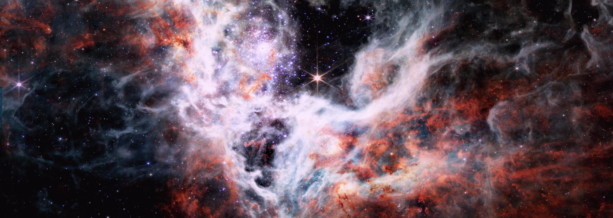
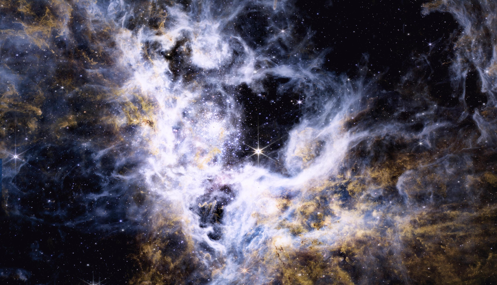
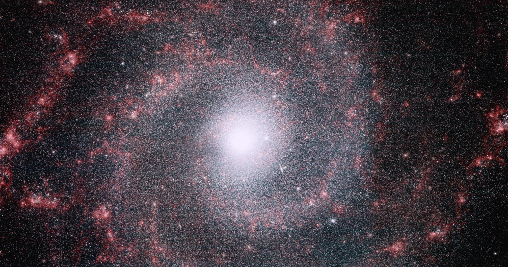

# Webbster

A simple, easy-to-use utility to transform raw JWST (James Webb Space Telescope) data into viewable, color images.

[](example_images/original/tarantula_nebula_custom_crop.jpg?raw=true)

## Index

- [Introduction](#introduction)
- [Getting started](#getting-started)
- [`fits-to-image.py`](#fits-to-imagepy)
  - [Usage](#usage)
  - [Arguments](#arguments)
  - [Notes](#notes)
- [`combine-layers.py`](#combine-layerspy)
  - [Usage](#usage-1)
  - [Arguments](#arguments-1)
  - [Notes](#notes-1)
  - [Colors file formatting](#colors-file-formatting)
- [Tutorial](#tutorial)
  - [1. Download data from the MAST Portal](#1-download-data-from-the-mast-portal)
  - [2. Turn the raw images into viewable, aligned images with `fits-to-image.py`](#2-turn-the-raw-images-into-viewable-aligned-images-with-fits-to-imagepy)
  - [3. Tweak the result using `combine-layers.py`](#3-tweak-the-result-using-combine-layerspy)
- [Downloading data from the MAST portal](#downloading-data-from-the-mast-portal)
  - [Choose an object](#choose-an-object)
  - [Download ZIP file](#download-zip-file)
  - [Extract `.fits` files](#extract-fits-files)
- [How it works](#how-it-works)
- [Example images](#example-images)
- [Future plans](#future-plans)

## Introduction

Every image you've seen is fake. Of course, when you take a picture, it represents a real object, but it does not look exactly as it would if you were there, looking at it yourself.

This is because cameras capture raw data, and it is the way that they synthesize this data into an image that determines how it will look. In the case of space telescopes, they capture images of objects that would be impossible to see with human eyes, whether it be light that is too dim or of an invisible wavelength.

So, our goal when processing these images is not necessarily realism, but more artistic considerations such as clarity, contrast, and beauty. Hopefully, this program can give you a starting point to realize your own artistic vision of space.

## Getting started

1. Clone this repo:

   ```
   git clone https://github.com/evoth/webbster.git
   ```

2. Install the required libraries:

   **WARNING:** Only tested for Python version 3.9

   ```
   pip3 install -r requirements.txt
   ```

3. Run [`fits-to-image.py`](#fits-to-imagepy) and/or [`combine-layers.py`](#combine-layerspy) as described in the [tutorial](#tutorial) below, modify my scripts, or write your own using the functions in the `webbster` module!

## `fits-to-image.py`

Converts a folder of FITS images to a single image. Optionally exports a monochrome image for each layer.

### Usage:

```
python fits-to-image.py [-h] [-j] INPUT_FOLDER OUTPUT_IMAGE [LAYERS_FOLDER]
```

### Arguments:

| Argument               | Description                                                 | Example             | Required? |
| ---------------------- | ----------------------------------------------------------- | ------------------- | --------- |
| `INPUT_FOLDER`         | A folder containing the JWST `.fits` files to compile       | `fits`              | Yes       |
| `OUTPUT_IMAGE`         | The filepath of the output image                            | `cosmic_cliffs.jpg` | Yes       |
| `LAYERS_FOLDER`        | Folder in which to export a monochrome image for each layer | `layers`            | No        |
| `-j` or `--jpg_layers` | When exporting layers, use .jpg extension instead of .png   |                     | No        |
| `-h` or `--help`       | Show help message                                           |                     | No        |

### Notes

- `INPUT_FOLDER` must be a folder of files ending in `_i2d.fits` taken at the same time by JWST (see [guide on downloading data](#downloading-data-from-the-mast-portal) below).
- Recommended file extensions for `OUTPUT_IMAGE` are either `.png` or `.jpg`. Using `.png` with give you near-lossless 8-bit images, but the files may be large. Using `.jpg` saves on space with little loss of quality.
- `LAYERS_FOLDER` is not required, but it is necessary if you end up wanting to tweak the colors using [`combine-layers.py`](#combine-layerspy).
  - The default extension for the layers is `.png`, but if you need to save on space, use the `-j` flag to save layers in `.jpg`.

## `combine-layers.py`

Converts a folder of monochrome layer images to a single image, with the option to customize the color of each layer.

### Usage:

```
python combine-layers.py [-h] [--export_colors_file EXPORT_COLORS_FILE] INPUT_FOLDER OUTPUT_IMAGE [COLORS_FILE]
```

### Arguments:

| Argument                                  | Description                                                                       | Example             | Required? |
| ----------------------------------------- | --------------------------------------------------------------------------------- | ------------------- | --------- |
| `INPUT_FOLDER`                            | A folder containing the monochrome layer images to compile                        | `layers`            | Yes       |
| `OUTPUT_IMAGE`                            | The filepath of the output image                                                  | `cosmic_cliffs.jpg` | Yes       |
| `COLORS_FILE`                             | Path to file with custom colors for each layer                                    | `custom_colors.txt` | No        |
| `--export_colors_file EXPORT_COLORS_FILE` | Path to export the colors used for each layer (in the same format as COLORS_FILE) | `colors.txt`        | No        |
| `-h` or `--help`                          | Show help message                                                                 |                     | No        |

### Notes

- The images in `INPUT_FOLDER` should be monochrome images generated by [`fits-to-image.py`](#fits-to-imagepy). Renaming them may cause issues because the script uses the filename to get the name of its filter when automatically choosing the color.
- Same as above, using `.png` as opposed to `.jpg` for `OUTPUT_IMAGE` may get you marginally better quality, at the cost of a bigger file. However, `.png` will be of no benefit if the images in `INPUT_FOLDER` are already saved as `.jpg`.
- For a guide on the formatting for `COLORS_FILE`, see below.

### Colors file formatting

The following is the format for each line of a colors file:

```
"FILEPATH" (HUE, SATURATION, VALUE)
```

- `FILEPATH` is the the path to an image in the specified folder
- `HUE`, `SATURATION`, and `VALUE` can each either be:
  - A single number (e.g. `75`)
  - A range (e.g. `75-100`), which will generate a random value on that range (inclusive)
- The ranges for `HUE`, `SATURATION`, and `VALUE` are [0-360], [0-100], and [0-100], respectively.

The following is an example colors file:

```
"layers/JW02731_NIRCAM-F090W.png" (200-240, 87, 100)
"layers/JW02731_NIRCAM-F187N.png" (208, 50-100, 100)
"layers/JW02731_NIRCAM-F200W.png" (200, 67, 100)
"layers/JW02731_NIRCAM-F335M.png" (0-359, 0-100, 0-100)
"layers/JW02731_NIRCAM-F444W.png" (4, 24, 100)
"layers/JW02731_NIRCAM-F470N.png" (0, 98, 100)
```

Any image present in the folder that is not referenced in the colors file will be colored as default from the filter name in the filename.

## Tutorial

### 1. Download data from the MAST Portal

- Follow the steps outlined in the [guide below](#downloading-data-from-the-mast-portal). After this is done, you should have a folder with only FITS files that end in `_i2d.fits`. Also check that `nircam` or `miri` is somewhere in each filename, since as of now this project is tailored toward NIRCAM and MIRI images from JWST.

### 2. Turn the raw images into viewable, aligned images with `fits-to-image.py`

- Take a look at [`fits-to-image.py`](#fits-to-imagepy) above. This script will turn each of our `.fits` files into a layer image, then attempt to combine these monochrome (black and white) images to make a color image.
- To do this, we tell the script where our `.fits` files are located, where we want the final image to be saved, and where we want it to save the intermediate layer images (the latter is optional, but necessary if we want to tweak the result like in step 3).
- For example, if your `.fits` files are in a folder called `fits`, and you want it to save the layers to a folder called `layers`, and you want the output image to be called `cosmic_cliffs.jpg`, then you would call `fits-to-image.py` as shown below:

  ```
  python fits-to-image.py fits cosmic_cliffs.jpg layers
  ```

- If everything worked correctly, the layers folder should now have a monochrome image named something like `JW02731_NIRCAM-F090W.png` for each `.fits` file you had, and the final image should also be ready to view!

### 3. Tweak the result using `combine-layers.py`

- See [`combine-layers.py`](#combine-layerspy) above. This script combines preprocessed layers images (created using `fits-to-image.py`) into a single color image, with the option to customize the colors of each layer so that you can get any look you want.
- Running `combine-layers.py` without specifying a "colors file" will simply result in the same image created in step 2. But, if we have it export the colors it used, we can then have a starting point from which to start getting creative.
- So, to get this "template" colors file, we can run `combine-layers.py` as shown below (assuming the same folders from step 2):

  ```
  python combine-layers.py layers cosmic_cliffs.jpg --export_colors_file colors.txt
  ```

- The result (`colors.txt` in this example) should look something like this:

  ```
  "layers/JW02731_NIRCAM-F090W.png" (239, 87, 100)
  "layers/JW02731_NIRCAM-F187N.png" (208, 100, 100)
  "layers/JW02731_NIRCAM-F200W.png" (200, 67, 100)
  "layers/JW02731_NIRCAM-F335M.png" (59, 75, 100)
  "layers/JW02731_NIRCAM-F444W.png" (4, 24, 100)
  "layers/JW02731_NIRCAM-F470N.png" (0, 98, 100)
  ```

- The values on the right are the (hue, saturation, value) for each layer, which you can tweak according to the [colors file formatting](#colors-file-formatting). Assuming we've done this and saved the file as `custom_colors.txt`, then you can make a new image using those colors by running `combine-layers.py` again, but this time using the file as an input:

  ```
  python combine-layers.py layers cosmic_cliffs_custom.jpg custom_colors.txt
  ```

- The new image file should reflect the changes you made!
- Also, if we still want to export the colors it uses (for example if you use random values), then just run it with both arguments:

  ```
  python combine-layers.py layers cosmic_cliffs_custom.jpg custom_colors.txt --export_colors_file colors_preset_1.txt
  ```

- This way, if you find something you like, you can save the colors file to use or improve on later.

## Downloading data from the MAST Portal

### Choose an object

If you don't know what object you want to make an image of, maybe try looking at the `Latest` or `First Images` links on the [Webb Space Telescope website](https://webb.nasa.gov/) to see what objects the JWST has already imaged.

### Download ZIP file

1. Go to the [MAST Portal website](https://mast.stsci.edu/portal/Mashup/Clients/Mast/Portal.html).
2. Under the search bar at the top, click `Advanced Search`.
3. In the text box for the `Mission` filter, type "`JWST`" and hit enter.
4. In the text box for the `Instrument` filter (you may have to scroll down a little), type "`NIRCAM`" and/or "`MIRI`" and hit enter.
5. Use the other filters to narrow down the search to your desired object:
   - The best way is to enter the object name into the `Object Name or Position` filter and press enter.
     - If you know an object's name (e.g. `Carina Nebula`) but not formal designation (e.g. `NGC 3324`), you can go its Wikipedia page and try the first designation listed under `Designations` in the sidebar on the right.
     - If you can't find a designation for the object that works, you can try filtering by `RA` (Right Ascension) and/or `Dec` (Declination). These can also be found in the Wikipedia sidebar for the object.
   - Wait for it to load if there is a loading indicator.
   - If you do this step correctly, the number of `Records Found` in the upper left corner should be no more than a dozen (usually 6 or less).
6. Press the `Search` button in the upper left corner.
7. You see should the results in a table (it may take some time to load).
8. Check the `Show Preview` option at the top of the table to show thumbnails for each result.
9. Select each image you want, making sure that they all have the same subject and framing.
10. Add data products to Download Basket by pressing the icon () at the top of the table.
11. Wait for it to retrieve the files.
12. Check the box next to `JWST` to select the files for download.
13. Press the `Download` button in the upper right corner, and press `Download` again in the confirmation popup.
14. The ZIP should start downloading. Depending on what you selected, it can be over 10GB, so make sure you have storage space available.

### Extract `.fits` files

1. Extract the downloaded ZIP.
2. Create a separate folder to hold the `.fits` files.
3. Open the extracted folder, and navigate further into the folder until there are multiple folders.
4. For each folder containing the word `nircam` or `miri`, open it and move the file ending in `_i2d.fits` to the folder created in step 2.
5. Now we have a folder with all the I2D (Image 2D) FITS files that we need to create a color image. Continue the [tutorial](#tutorial) or run [`fits-to-image.py`](#fits-to-imagepy) on this folder.

## How it works

[coming soon]

## Example images

| From `fits-to-image.py` (cropped)                                                                                                                         | Tweaked using `combine-layers.py`                                                                                                                                       | Colors file used                                                                   |
| --------------------------------------------------------------------------------------------------------------------------------------------------------- | ----------------------------------------------------------------------------------------------------------------------------------------------------------------------- | ---------------------------------------------------------------------------------- |
| [](example_images/original/tarantula_nebula.jpg?raw=true)                              | [](example_images/original/tarantula_nebula_custom.jpg?raw=true)                              | [tarantula_nebula.txt](example_images/colors/tarantula_nebula.txt)                 |
| [](example_images/original/cosmic_cliffs.jpg?raw=true)                                       | [](example_images/original/cosmic_cliffs_custom.jpg?raw=true)                                       | [cosmic_cliffs.txt](example_images/colors/cosmic_cliffs.txt)                       |
| [](example_images/original/southern_ring_nebula.jpg?raw=true)                  | [](example_images/original/southern_ring_nebula_custom.jpg?raw=true)                  | [southern_ring_nebula.txt](example_images/colors/southern_ring_nebula.txt)         |
| [](example_images/original/pillars_of_creation.jpg?raw=true)                     | [](example_images/original/pillars_of_creation_custom.jpg?raw=true)                     | [pillars_of_creation.txt](example_images/colors/pillars_of_creation.txt)           |
| [](example_images/original/pillars_of_creation_miri.jpg?raw=true)      | [](example_images/original/pillars_of_creation_miri_custom.jpg?raw=true)      | [pillars_of_creation_miri.txt](example_images/colors/pillars_of_creation_miri.txt) |
| [](example_images/original/pillars_of_creation_comp.jpg?raw=true) | [](example_images/original/pillars_of_creation_comp_custom.jpg?raw=true) | [pillars_of_creation_comp.txt](example_images/colors/pillars_of_creation_comp.txt) |
| [](example_images/original/messier_74.jpg?raw=true)                                                | [](example_images/original/messier_74_custom.jpg?raw=true)                                                | [messier_74.txt](example_images/colors/messier_74.txt)                             |

Note: If you plan on using one of the colors files provided here, make sure you download the correct FITS images and update the filepaths to match your directory structure.

## Future Plans

My ultimate goal for this project would be a totally self contained GUI app to download, process, and edit these images. I have already done some work on this, but it will probably not be done for a while.

Additionally, I would like to support other space telescopes and release these utilities as a Python package.
